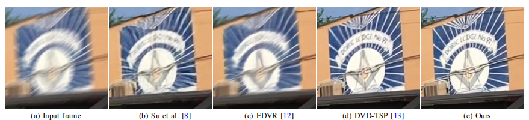

# Deblurring Videos Using Spatial-Temporal Contextual Transformer with Feature Propagation
[Liyan Zhang](https://faculty.nuaa.edu.cn/zhangliyan/en/index/169476/list/index.htm), [Boming Xu](https://github.com/xuboming8), [Zhongbao Yang](https://github.com/yzb1997), [Jinshan Pan](https://jspan.github.io/)

<p align="center">
  
</p>

### Abstract 
*We present a simple and effective approach to explore both local spatial-temporal contexts and non-local temporal information for video deblurring. First, we develop an effective spatial-temporal contextual transformer to explore local spatialtemporal contexts from videos. As the features extracted by the spatial-temporal contextual transformer does not model the nonlocal temporal information of video well, we then develop a feature propagation method to aggregate useful features from the long-range frames so that both local spatial-temporal contexts and non-local temporal information can be better utilized for video deblurring. Finally, we formulate the spatial-temporal contextual transformer with the feature propagation into a unified deep convolutional neural network (CNN) and train it in an end-to-end manner. We show that using the spatial-temporal contextual transformer with the feature propagation is able to generate useful features and makes the deep CNN model more compact and effective for video deblurring. Extensive  experimental results show that the proposed method performs favorably against state-of-the-art ones on the benchmark datasets in terms of accuracy and model parameters.*

## Demo Video
*Demo whit visualization on the DVD dataset of the model (Input,  Ours from left to right)*

https://github.com/yzb1997/STCT/assets/54924380/1e195076-88b4-44f2-ab37-090ddec9eefe

https://github.com/yzb1997/STCT/assets/54924380/dd3dcb3d-4a27-43ff-8801-0d7deb109abc

*Demo whit visualization on the GOPRO dataset of the model (Input,  Ours from left to right)*

https://github.com/yzb1997/STCT/assets/54924380/a244e19b-1161-4f20-a369-dda855a9a14e

https://github.com/yzb1997/STCT/assets/54924380/e3340336-b24d-41cf-bea3-217145c7cd2a

### Requirements
> - Python 3.8, PyTorch >= 1.11
> - BasicSR 1.4.2
> - Platforms: Ubuntu 18.04, cuda-11

### Installation
```
# Clone the repo
git clone https://github.com/yzb1997/STCT.git
# Install dependent packages
cd STCT
pip install -r requirements.txt
# Install BasicSR
python setup.py develop
```
You can also refer to this [INSTALL.md](https://github.com/XPixelGroup/BasicSR/blob/master/docs/INSTALL.md) for installation

### Training
- Down the SpyNet pretrained and put it in './experiments' [Google Drive](https://drive.google.com/drive/folders/10a0Szaioc-qnXZguG6sk8EELhNB_2cqZ?usp=drive_link)/[Baidu Netdisk](https://pan.baidu.com/s/1pBdrL5K1wbi5iU02NtIWgQ?pwd=44q8) 
- Run the following commands for training:
```
# train STCT on the BSD dataset
python basicsr/train.py -opt options/train/Deblur/train_Deblur_BSD.yml

# train STCT on the DVD dataset
python basicsr/train.py -opt options/train/Deblur/train_Deblur_DVD.yml

# train STCT on the GOPRO dataset
python basicsr/train.py -opt options/train/Deblur/train_Deblur_GOPRO.yml

# train STCT on the REAL dataset
python basicsr/train.py -opt options/train/Deblur/train_Deblur_REAL.yml

# train STCT on the REDS dataset
python basicsr/train.py -opt options/train/Deblur/train_Deblur_REDS.yml
```
### Testing 
- Download the pretrained models.
- Download the testing dataset.
- Run the following commands:
```
# test STCT on the BSD dataset
python basicsr/test.py -opt options/train/Deblur/train_Deblur_BSD.yml

# test STCT on the DVD dataset
python basicsr/test.py -opt options/train/Deblur/train_Deblur_DVD.yml

# test STCT on the GOPRO dataset
python basicsr/test.py -opt options/train/Deblur/train_Deblur_GOPRO.yml

# test STCT on the REAL dataset
python basicsr/test.py -opt options/train/Deblur/train_Deblur_REAL.yml

# test STCT on the REDS dataset
python basicsr/test.py -opt options/train/Deblur/train_Deblur_REDS.yml
```
- The test results will be in './results'.


| Degradation | Model Zoo| 
| :----- |:-----: |
| GOPRO | [Google Drive](https://drive.google.com/file/d/1R_cP48HoNduY5MvhSdyZpIxCvVjnrDGz/view?usp=drive_link)/[Baidu Netdisk](https://pan.baidu.com/s/1A-r8Ntqc7csx_07asnbIig?pwd=vurk) with code: STCT |
| DVD | [Google Drive](https://drive.google.com/file/d/1YeyilUC5zcx62WAa5bxVVKiYG3U2pPrX/view?usp=drive_link)/[Baidu Netdisk](https://pan.baidu.com/s/1dEFC77mU5B0X-uTlIZW59A?pwd=fwge) with code: STCT | 
| BSD | [Google Drive](https://drive.google.com/file/d/18ngyaUxUgrC_cLAYsIKQ8sMZm0ECnZ7t/view?usp=drive_link)/[Baidu Netdisk](https://pan.baidu.com/s/1Saow7aMjYkhXYTfKE1p_DA?pwd=ke59) with code: STCT |  


### Results
- **Pretrained models and visual results**

- **Deblurred results on a challenging video**
<p align="center">  
  
</p>

- **Deblurred results on the GOPRO test dataset**
<p align="center">
  
</p>

<!-- - **Efficient SR Results**
<p align="center">
  
</p>

- **Classic SR Results**


- **Real-world SR Results** 

|Real-World Image (x4)|Real-ESRGAN  |SwinIR     | SAFMN (ours)|
|       :---          |     :---:   |  :-----:  |  :-----:    |        
| |||
| |||
| |||
| |||

[](https://imgsli.com/MTkwMzE2/6/7) 


### Citation
If this work is helpful for your research, please consider citing the following BibTeX entry.
```
@inproceedings{
    
 }
 ``` -->


### Acknowledgement
This code is based on [BasicSR](https://github.com/XPixelGroup/BasicSR) toolbox. Thanks for the awesome work.
Please contact [Liyan Zhang](https://faculty.nuaa.edu.cn/zhangliyan/en/index/169476/list/index.htm), [Boming Xu](https://github.com/xuboming8), [Jinshan Pan](https://jspan.github.io/) if there is any issues.
